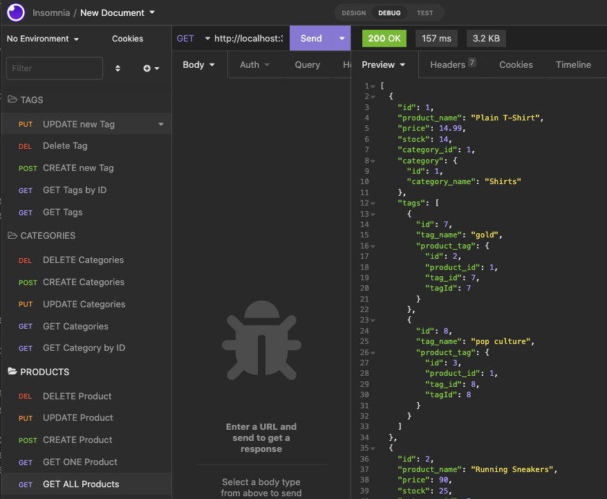

# e-commerce-back-end
Build a back end for an e-commerce site

UCLA Bootcamp Challenge  - Module 13

Due Date 11/05/2022

## Challenge Tasks

Build a back end for an e-commerce site using Express.js API and Sequelize to interact with MySQL.

## User Story

```md
AS A manager at an internet retail company
I WANT a back end for my e-commerce website that uses the latest technologies
SO THAT my company can compete with other e-commerce companies
```

## Acceptance Criteria

```md
GIVEN a functional Express.js API
WHEN I add my database name, MySQL username, and MySQL password to an environment variable file
THEN I am able to connect to a database using Sequelize
WHEN I enter schema and seed commands
THEN a development database is created and is seeded with test data
WHEN I enter the command to invoke the application
THEN my server is started and the Sequelize models are synced to the MySQL database
WHEN I open API GET routes in Insomnia for categories, products, or tags
THEN the data for each of these routes is displayed in a formatted JSON
WHEN I test API POST, PUT, and DELETE routes in Insomnia
THEN I am able to successfully create, update, and delete data in my database
```

- following image shows the Insomnia Testing for Product, Category and Tag


## Video
You can see a video demonstration for this app [here](https://drive.google.com/file/d/16pICdp8RTs5YfCrIupF03Ufhs2LhdhtM/view)

## GitHub 
ReRepository for Team Profile application can be found at: [GitHub](https://github.com/Me-ross/e-commerce-back-end)